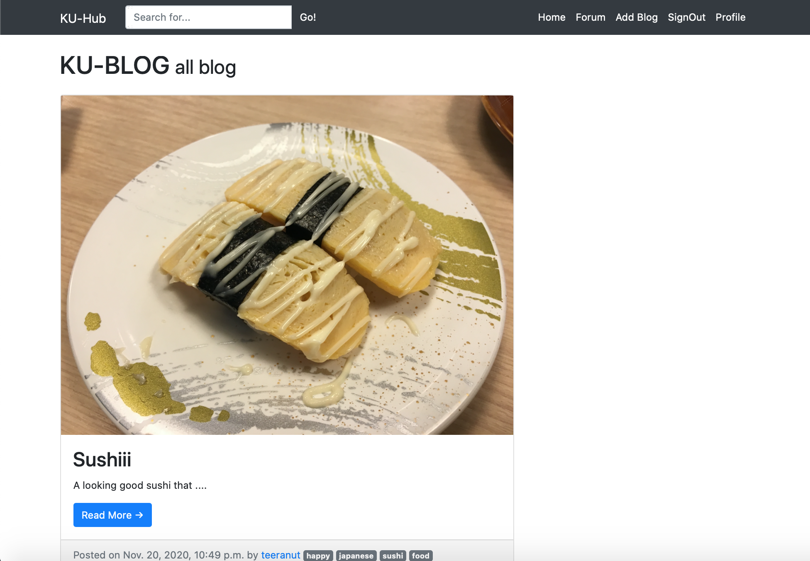

# KU-Hub

KU Hub is a webboard site for KU students to share opinions or 
perspectives on things in Kasetsart University. By using the features 
of commenting and posting in our application as the medium for 
communication, the students will be able to communicate and convey their 
message to each other way easier than using a normal board along places. 
It helps students know what other students want to tell the world. 
Moreover, the discussion will be useful for our ideas improvement due to 
the fact that it gives us many ways of thinking. 

To sign in KU Hub, KU email is required to determine the user identities.

## Team Members
| Name       |      GitHub ID     |
|----------|:-------------:|
| Bheem Suttipong        |     [Bheem6005](https://github.com/Bheem6005)    |
| Narawish Sangsiriwut        |     [NarawishS](https://github.com/NarawishS)      |
| Sahatsawat Kanpai        |      [keyboard2543](https://github.com/keyboard2543)      |
| Teeranut Sawanyawat        |     [LevNut](https://github.com/LevNut)       |

## Quick start (running the KU-Hub application)

### Requirements
* Language: Python 3.7
* Back-end Framework: Django
    * All-auth
    * Taggit
* Front-end Framework: Bootstrap
* CSS
* HTML

### Steps for starting application
1. Clone this project and change directory to be `ku-hub`.

        $ git clone https://github.com/NarawishS/ku-hub.git
        $ cd ku-hub/
        
2. Create virtual environment directory using this command.

        $ virtualenv venv

3. Activate virtual environment due to your os.
   For Window:
    
        $ venv\Scripts\activate
        
    For Mac/Linux:
    
        $ source venv/bin/activate
        
4. Install modules in [requirements.txt](requirements.txt) using 
  
        $ pip install -r requirements.txt

5. Use mysite/sample.env as a template, then create/edit your own
.env file and set their values.

        DEBUG=True
        TEMPLATE_DEBUG=True
        SECRET_KEY=Your-Secret-Key
        client_id=Your-Client-Id
        secret=Your-Client-Secret
        
    * For client id and secret, you can create that step by step 
    from [HERE](https://developers.google.com/adwords/api/docs/guides/authentication)

6. Create initial migration, then apply the change 
       
       $ python manage.py makemigrations
       $ python manage.py migrate
       
7. Run this command to run the server

       $ python manage.py runserver
       
8. For deactivate virtual environment

        $ deactivate

## Documentations
* [Wiki's Homepage](https://github.com/NarawishS/ku-hub/wiki)
* [Vision Statement](https://github.com/NarawishS/ku-hub/wiki/Vision-Statement)
* [Requirements](https://github.com/NarawishS/ku-hub/wiki/Requirements)
* [Iteration 1 Plan](https://github.com/NarawishS/ku-hub/wiki/Iteration-1-Plan)
    * [Task Board](https://github.com/NarawishS/ku-hub/projects/1)
    * [Review](https://github.com/NarawishS/ku-hub/wiki/Iteration-1-Review)
    * [Retrospective](https://github.com/NarawishS/ku-hub/wiki/Iteration-1-Retrospective)
* [Iteration 2 Plan](https://github.com/NarawishS/ku-hub/wiki/Iteration-2-Plan)
    * [Task Board](https://github.com/NarawishS/ku-hub/projects/2)
    * [Review](https://github.com/NarawishS/ku-hub/wiki/Iteration-2-Review)
    * [Retrospective](https://github.com/NarawishS/ku-hub/wiki/Iteration-2-Retrospective)
* [Iteration 3 Plan](https://github.com/NarawishS/ku-hub/wiki/Iteration-3-Plan)
    * [Task Board](https://github.com/NarawishS/ku-hub/projects/4)
    * [Review](https://github.com/NarawishS/ku-hub/wiki/Iteration-3-Review)
    * [Retrospective](https://github.com/NarawishS/ku-hub/wiki/Iteration-3-Retrospective)
* [Iteration 4 Plan](https://github.com/NarawishS/ku-hub/wiki/Iteration-4-Plan)
    * [Task Board](https://github.com/NarawishS/ku-hub/projects/5)
    * [Review](https://github.com/NarawishS/ku-hub/wiki/Iteration-4-Review)
    * [Retrospective](https://github.com/NarawishS/ku-hub/wiki/Iteration-4-Retrospective)
* [Iteration 5 Plan](https://github.com/NarawishS/ku-hub/wiki/Iteration-5-Plan)
    * [Task Board]()
    * [Review]()
    * [Retrospective]()
* [Code Review Checklist](https://github.com/NarawishS/ku-hub/wiki/Code-Review-Checklist)
* [Code Review Procedure](https://github.com/NarawishS/ku-hub/wiki/Code-Review-Procedure)